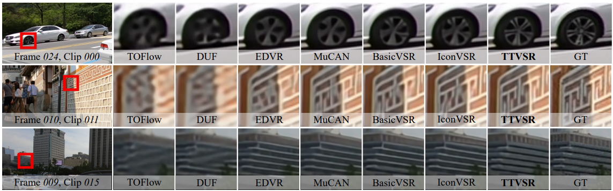
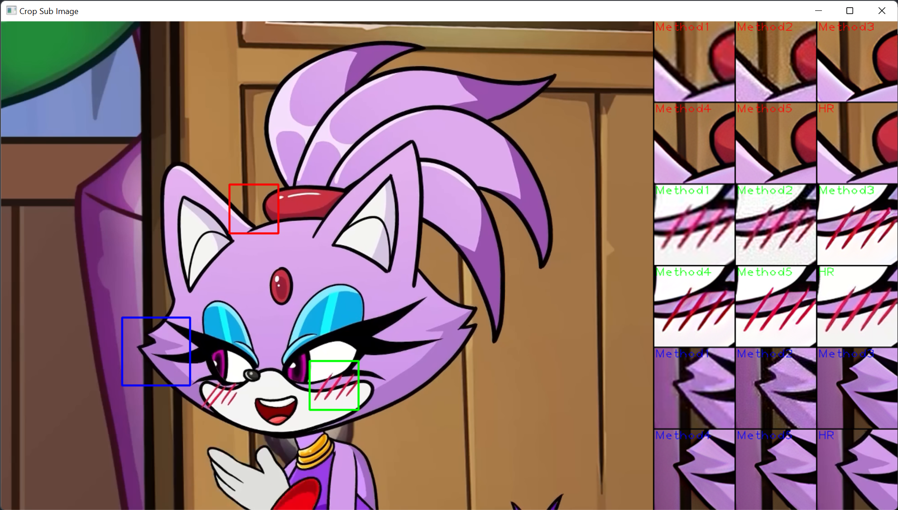
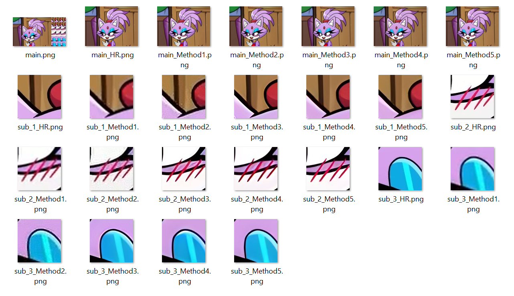

# Restoration-ImageViewer
This is a simple toolkit to view and crop image patches for image/video restoration tasks. In image/video restoration, the authors usually need to show the full image and its zoom-in regions for better visualization like the figure shown below.



## Dependencies
* python 3.X (recommend to use [Anaconda](https://www.anaconda.com/))
* opencv-python

## Configurations
```python
result_names = ['SRCNN', 'EDSR', 'RCAN', 'RRDB', 'Ours', 'HR'] # name of each methods
result_paths = ['Set5_SRCNN', 'Set5_EDSR', 'Set5_RCAN', 'Set5_RRDN', 'Set5_Ours', 'Set5_HR'] # result path of each methods
main_index = -1 # index of the main figure (defalut: HR)
n_cols = 3 # number of columns to show the cropped regions.
win_h = 720 # window height
box_min, box_max, box_step = int(win_h * 0.1), win_h, int(win_h * 0.01) # min/max cropped box size, step size of box adjustment
box_thickness, box_color = 2, (0, 0, 255) # box thickness, box color
sub_num, sub_colors = 3, [(0, 0, 255), (0, 255, 0), (255, 0, 0)] # number of crop regions, colors of each crop region
pad_size, pad_color = 2, (0, 0, 0) # pad size and color
show_name = True # render method name on saved images
```

## Usages
Setup all the configurations and run the script, you will see a window like this:
   


### Crop main figures
The red box indicates the crop region of the main figure. By default, it is the same as the full image. 

For some datasets, it has different aspect ratios, authors usually need to crop the main figure into the same aspect ratios for better visualization of the figure.

Press key `a` or `d` to choose the image you want to crop.


The number keys of `1` (same as the input), `2` (1:1), `3` (3:4), and `4` (16:9) are used to switch between different aspect ratios. The mouse wheel is used to change the box size. The key `s` is used to save the cropped main figure. The key `q` is used to quite the toolkit without saving.

### Crop sub-figures
After cropping the main figures, the toolkit will open another window to crop and show sub-figures of different methods:



To crop more than one sub-figure, you may need to setup the configure file and press `s` for several times to save each crop regions.

### Final saved results
The cropped resutls will be saved in the `crops/image_path_datetime` folder:



The folder contains an overall image and all main figures and its sub-figures. The sub-figures in the overall figure is bicubic resized to align their resolution. All the other figures are saved in its original resolution without any resize which means it could be directly used in the paper. 

## Contact
If you meet any problems when using this toolkit, please feel free to raise an issue.